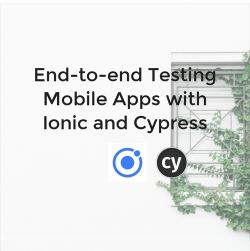

# End-to-end testing mobile apps with Ionic and Cypress

Hello! This is the repository for the "End-to-end testing mobile apps with Ionic and Cypress" talk at Ioniconf 2020.

[Talk Slides](https://cypress.slides.com/cecelia/deck)

This contains a fork of the [Ionic Angular Conference Application](https://github.com/ionic-team/ionic-conference-app). 

The `main` branch contains the complete specs of Cypress tests written for the talk. 

If you want to start from scratch and try it yourself, checkout the `starter` branch.

The following spec files are included and demonstrate specific test scenarios (in order from talk):

- `iphone-5-critical-path.spec.js`
- `viewport.spec.js`
- `storage.spec.js`
- `swipe.spec.js`

## Running the App

Peep these awesome instructions straight from the ionic-conference-app repo:

### Getting Started

* [Download the installer](https://nodejs.org/) for Node LTS.
* Install the ionic CLI globally: `npm install -g ionic`
* Clone this repository: `git clone https://github.com/ionic-team/ionic-conference-app.git`.
* Run `npm install` from the project root.
* Run `ionic serve` in a terminal from the project root.
* Profit. :tada:

_Note: See [How to Prevent Permissions Errors](https://docs.npmjs.com/getting-started/fixing-npm-permissions) if you are running into issues when trying to install packages globally._

## Running the Tests

Cypress is a dependency of this repo and will install in the previous step. You'll need to update the `baseUrl` in the `cypress.json` file to match the port where your app is running.

### Cypress Open Mode

With the app running, in a new terminal run `npx cypress open` to open the Test Runner.

Click the `iphone-5-critical-path.spec.js` folder.

Watch the magic happen. :sparkle:

### Cypress Run Mode

If you'd like to run your tests headlessly, in CI, or record the results to the Cypress Dashboard, you can bypass the Test Runner using `npx cypress run` instead.

There are a lot of [fancy options you can pass](https://docs.cypress.io/guides/guides/command-line.html#cypress-run), including specifying a browser, setting environment variables, and passing your record key for the Dashboard. 

Links to slides and a video of the talk coming soon!

Want to learn more?

- [Cypress Documentation](https://docs.cypress.io)
- [Ionic Documentation](https://ionicframework.com/docs)

Feel free to say hi to me on Twitter [@ceceliacreates](https://www.twitter.com/ceceliacreates) or [create an issue here](https://github.com/ceceliacreates/ionic-cypress/issues/new) with comments and questions!
